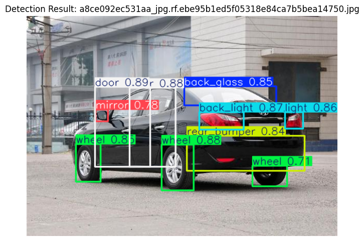
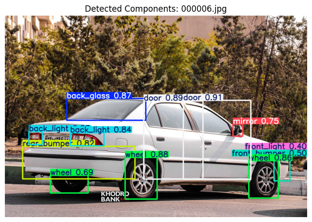

# YOLOv12 Object Detection Projects

This repository contains two separate but related notebooks showcasing the use of **YOLOv12** for object detection tasks. The first notebook focuses on inference and visualization using pre-trained YOLOv12 models. The second notebook details the full training pipeline on a custom dataset (car components), along with data augmentation and evaluation.

---

## 1. `yolov12_inference_and_visualization.ipynb`

This notebook demonstrates the use of YOLOv12's small (`yolov12s.pt`), medium (`yolov12m.pt`), and large (`yolov12l.pt`) models for inference on a sample image.

### Key Features:
- Download and visualize a test image using PIL and Supervision.
- Compare inference and total runtime for different model variants.
- Visualize detection results using `supervision` library (bounding boxes + labels).
- Filter and visualize only the 'person' class using both raw PIL and `supervision`.
- Provides performance insights on model size vs. detection speed.

> ?? Use case: Benchmarking pre-trained YOLOv12 models on sample inputs.

---

## 2. `yolov12_training_car_components.ipynb`

This notebook covers the **complete pipeline** of training a YOLOv12 model on a **car components dataset** from Roboflow, including dataset analysis, augmentation, training, and inference.

### Key Features:
- **Dataset Handling**:
  - Automatically downloads version 11 of the car components dataset.
  - Analyzes dataset splits and class distributions.
  - Visualizes annotations from `.txt` YOLO-format labels.

- **Data Augmentation**:
  - Uses `albumentations` for image-level and box-level augmentation.
  - Merges augmented data back into the training set.
  - Includes visualization of augmented annotations.

- **Training & Evaluation**:
  - Fine-tunes `yolov12l.pt` on the car components dataset.
  - Monitors training time and results.
  - Evaluates the model on both validation and test sets using mAP and other metrics.

- **Real-world Deployment**:
  - Uses `icrawler` to download Iranian car images from Google.
  - Performs inference using the fine-tuned model on unseen, real-world data.

### Additional Files:
- **Trained Model**: `best.pt` (YOLOv12 fine-tuned weights).
- **Images for Demo**:
  
  <p float="left">
    
    
  </p>


> Use case: Training a domain-specific YOLOv12 model and evaluating it on both benchmark and real-world data.

---

## Requirements

Install dependencies:

```bash
pip install ultralytics
pip install git+https://github.com/sunsmarterjie/yolov12.git
pip install supervision roboflow icrawler albumentations
````

---

## Credits

* [Ultralytics YOLOv12](https://github.com/ultralytics/ultralytics)
* [Roboflow Dataset](https://universe.roboflow.com/)
* [Supervision](https://github.com/roboflow/supervision)
* [Albumentations](https://github.com/albumentations-team/albumentations)

---

## Note

* The Roboflow API key is required to download the dataset.
* The `.pt` model (YOLOv12 fine-tuned weights) is assumed to be available in `runs/detect/.../best.pt`.

```


